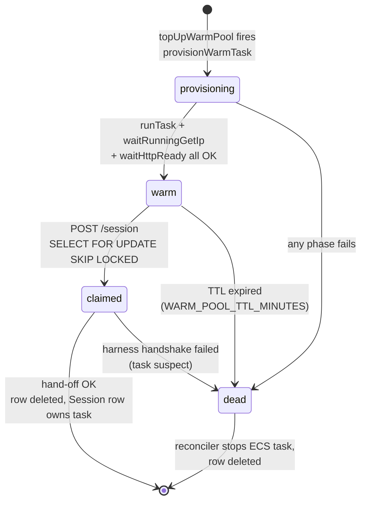
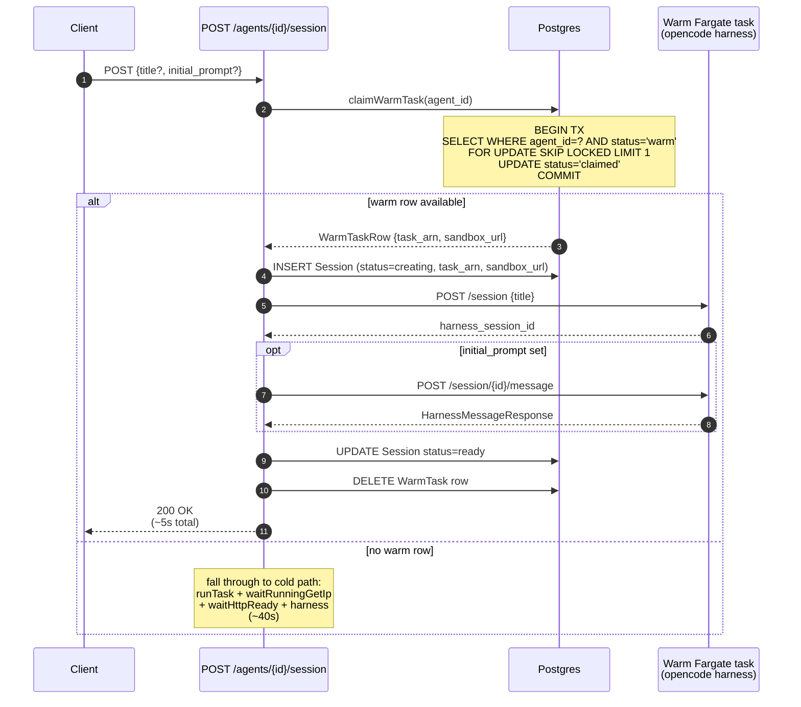
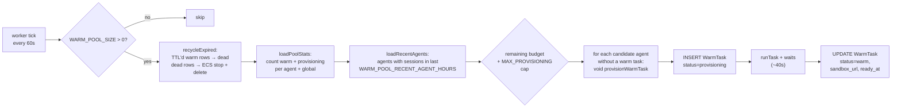

# Warm pool

Pre-provisioned Fargate tasks that the platform hands out on `POST /agents/{id}/session`. Removes the ~40s cold-start tax (ECS scheduler + ECR pull + opencode boot) from the request path.

## Why this exists

A cold session create runs five sequential phases inside the request: ECS RunTask, ECS scheduler queue, ECR image pull, container start, opencode HTTP-ready. Live measurements average **~40s** end-to-end, dominated by the scheduler queue (~17s) and opencode warm-up (~15s) — both structural to Fargate, neither addressable from inside the request.

The warm pool moves those phases out of the critical path: a background worker keeps N tasks pre-warmed for the most-recently-used agents, and `POST /session` claims one in a single DB round-trip. Happy-path session create drops to **~5s** (one harness handshake, one DB write).

## Per-agent constraint

Warm tasks **cannot be agent-fungible** — `src/server/fargate.ts:buildContainerEnv` injects `REPO_URL`, `BRANCH`, and `AGENT_PROMPT` as container env at boot, and the opencode harness reads them then. A task launched for agent A can never serve a request for agent B even if A and B share a task definition.

So `WarmTask` carries an `agent_id`, and `claimWarmTask(agent_id)` only matches rows for that exact agent. The pool is shared across agents (capped by `WARM_POOL_SIZE` total) but each row is bound to one.

## Components

```
┌────────────────────────────────────────────────────────────────────────────┐
│                                                                            │
│   src/server/warmPool/index.ts                                             │
│   ─────────────────────────────                                            │
│      claimWarmTask(agent_id)        ◄── called from POST /session          │
│      provisionWarmTask(agent)       ◄── fired by topUpWarmPool             │
│      topUpWarmPool()                ◄── called from worker tick            │
│      deleteClaimedWarmTask          ◄── after successful hand-off          │
│      markClaimedTaskDead            ◄── after failed hand-off              │
│                                                                            │
│   src/worker/index.ts                                                      │
│   ───────────────────                                                      │
│      tick(): reconcileOrphans() + topUpWarmPool()                          │
│      runs every RECONCILE_INTERVAL_SECONDS (default 60s)                   │
│                                                                            │
│   src/server/reconcile.ts                                                  │
│   ────────────────────────                                                 │
│      sweepWarmOrphans(): stops ECS tasks whose WarmTask row is gone        │
│                                                                            │
│   prisma/schema.prisma                                                     │
│   ─────────────────────                                                    │
│      model WarmTask { warm_task_id, agent_id, status, task_arn,            │
│                       sandbox_url, created_at, ready_at, claimed_at }      │
│                                                                            │
└────────────────────────────────────────────────────────────────────────────┘
```

## Lifecycle



## Request path — claim flow



## Background path — top-up loop



## Configuration

All knobs live on `env` (read from process env at startup, see `src/server/env.ts`).

| env var | default | meaning |
|---|---|---|
| `WARM_POOL_SIZE` | `2` | total warm + provisioning rows. `0` disables the feature entirely (`claimWarmTask` short-circuits to `null`, `topUpWarmPool` short-circuits to a no-op). |
| `WARM_POOL_MAX_PROVISIONING` | `2` | concurrency cap on the top-up loop — at most this many `provisionWarmTask` calls fire per tick. Avoids hammering ECS RunTask when the pool fully drains. |
| `WARM_POOL_TTL_MINUTES` | `30` | warm rows older than this are recycled by `recycleExpired`. Bounds the staleness of containers (image rotation, harness state, etc.). |
| `WARM_POOL_RECENT_AGENT_HOURS` | `24` | only agents that created a session within this window are candidates for warming. Prevents the pool from burning capacity on agents the user has stopped using. |

### Sizing

The pool needs to absorb the burstiest minute of session creates; below that, you fall through to the cold path.

```
WARM_POOL_SIZE  ≥  peak_creates_per_minute  ×  (40s / 60s)  ×  safety_factor
```

Cost reference: 512 CPU / 1024 mem Fargate task ≈ **$0.022/hr** ≈ $16/mo per slot. Default `WARM_POOL_SIZE=2` ≈ $32/mo.

## Failure modes

| failure | what happens |
|---|---|
| `provisionWarmTask` fails (RunTask error, ECR pull timeout, opencode never replies) | row marked `dead`; reconciler stops the underlying ECS task on next sweep; next tick provisions a replacement. |
| Operator deletes a `WarmTask` row out from under the worker | `sweepWarmOrphans` (in `reconcile.ts`) finds the ECS task tagged `litellm_warm_task_id=...` with no DB row and stops it; respects `RECONCILE_NEW_TASK_GRACE_MS` so freshly launched tasks aren't killed before their row commits. |
| Harness handshake fails after claim | `Session` row marked `failed`, `WarmTask` row marked `dead` (the task is suspect — handing the same one out again would just fail). User retries → next attempt either claims a different warm task or falls through to cold. |
| Concurrent claims for the same warm row | `SELECT … FOR UPDATE SKIP LOCKED` guarantees only one transaction wins. The loser sees `null` and falls through to the cold path. |
| `claimed` row is never deleted (process crash between claim and delete) | reconciler treats `claimed` as a terminal state for warm-tagged tasks and stops the ECS task. The half-created Session row will eventually time out via `SESSION_CREATING_TIMEOUT_MS` and be marked `failed`. |

## Observability

Worker logs one line per tick when there's anything to report:

```
warm_pool: provisioned=2 recycled=0 fallback_dead=0
```

Useful Postgres queries:

```sql
-- pool depth right now
SELECT status, COUNT(*) FROM managed_agent_warm_task GROUP BY status;

-- which agents are warmed
SELECT agent_id, status, COUNT(*) FROM managed_agent_warm_task
GROUP BY agent_id, status ORDER BY agent_id;

-- mean time-to-warm
SELECT AVG(EXTRACT(EPOCH FROM (ready_at - created_at)))
FROM managed_agent_warm_task WHERE ready_at IS NOT NULL;
```

## Operational notes

- **Image rotation.** Pushing a new harness image doesn't invalidate live warm tasks — they keep running the old image until `WARM_POOL_TTL_MINUTES` recycles them. For an immediate cutover, run `UPDATE managed_agent_warm_task SET status='dead' WHERE status='warm'` and the next tick will both stop the old tasks and provision replacements.
- **Multiple worker instances.** `topUpWarmPool` is safe under concurrent execution — `provisionWarmTask` inserts a row before launching the task, so the next worker's `loadPoolStats` sees the in-flight provision and doesn't double-fire. `claimWarmTask` uses `SKIP LOCKED` for the same reason.
- **Fresh deploy.** A brand-new deploy starts with an empty pool. The first session create for any agent is cold; the worker tick after that session is committed sees the agent as "recently active" and starts warming. Steady state kicks in after ~1 minute.
